<div align="center">


# MyAgenda

A personal task manager built for focus and clarity, with tools to organize tasks across projects and subprojects, track due dates, attach notes and images, and switch between List, Board, and Agenda views.

**[English](#english) · [Português](#português)**

</div>

<p align="center">
  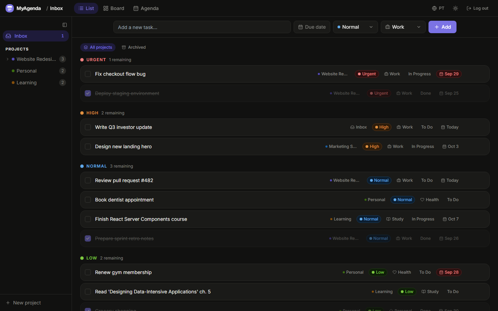
</p>

---

## English

### About

MyAgenda is a full-stack task manager built solo, with real structure behind it: projects can nest one level deep, tasks carry priority, category, status, and due-date metadata, and every task has a dedicated detail view with autosave, rich notes, and image attachments.

It started as a portfolio project meant to show a complete slice of full-stack work: a typed React front end, a Postgres schema with Row Level Security enforced at the database layer rather than hidden in the UI, private per-user file storage, and a bilingual, themeable interface. The repository is meant to be cloned and self-hosted, so each person provisions their own free-tier Supabase project instead of relying on a shared backend.

### Screenshots

<table>
  <tr>
    <td align="center">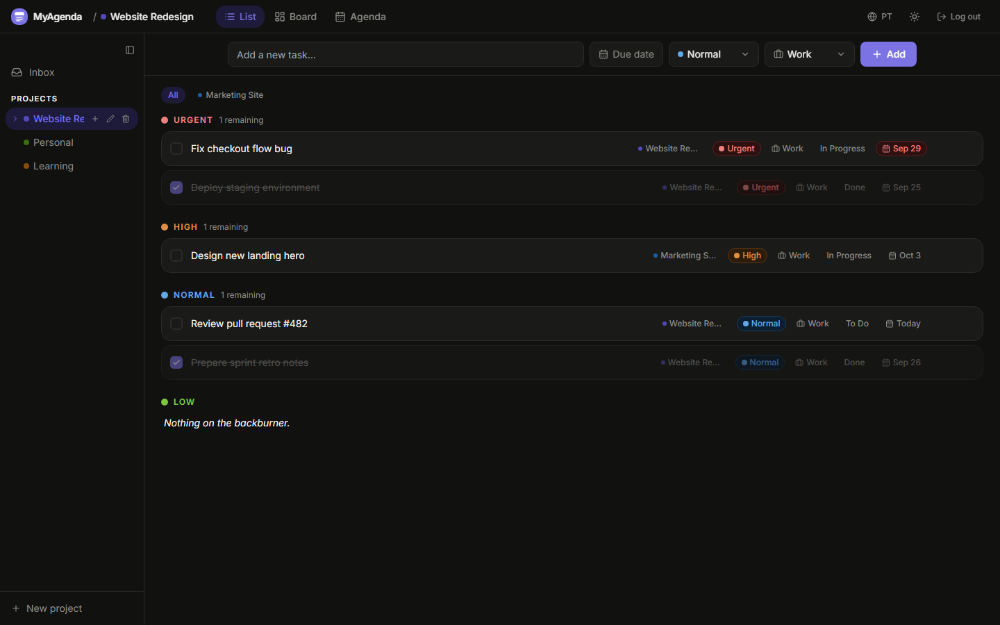<br /><sub>List view, grouped by priority</sub></td>
    <td align="center">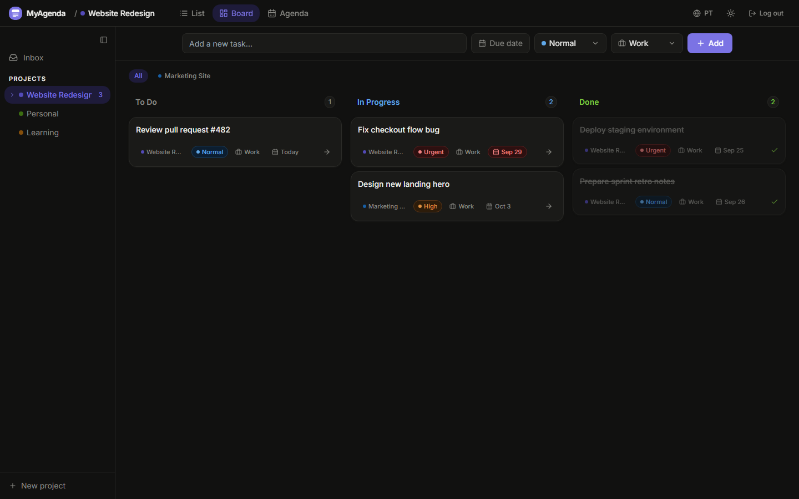<br /><sub>Board view, drag-and-drop Kanban</sub></td>
  </tr>
  <tr>
    <td align="center">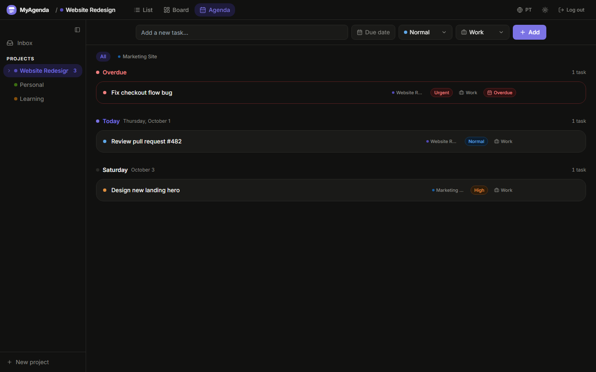<br /><sub>Agenda view, grouped by due date</sub></td>
    <td align="center">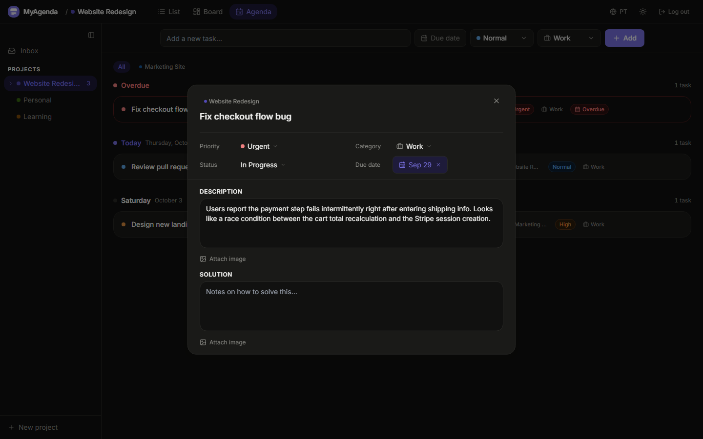<br /><sub>Task detail, autosave, notes, images</sub></td>
  </tr>
  <tr>
    <td align="center">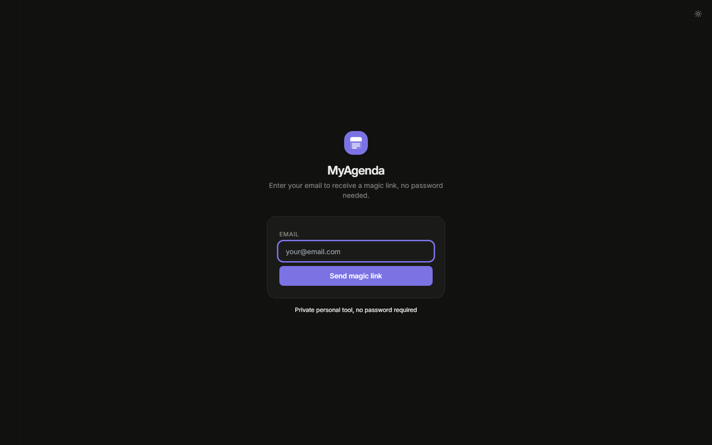<br /><sub>Magic link sign-in</sub></td>
    <td align="center">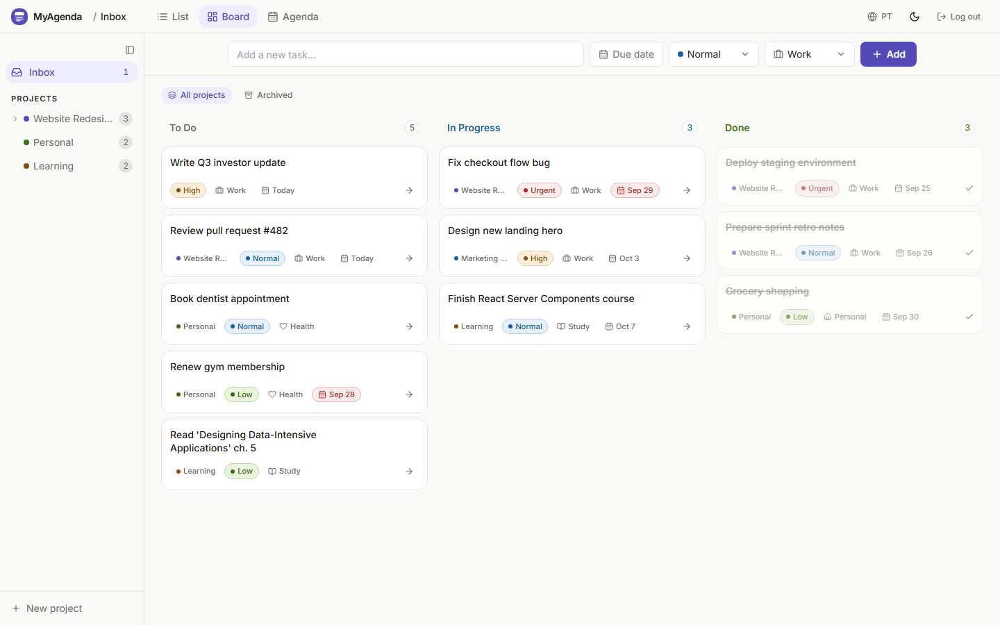<br /><sub>Light theme (dark is the default above)</sub></td>
  </tr>
</table>

### Features

- **Magic link auth**, passwordless sign-in via email
- **Projects & subprojects**, one level of nesting; parent projects roll up tasks from all children
- **Three views**, List (grouped by priority), Board (Kanban), Agenda (grouped by due date)
- **Task detail modal**, autosaves as you type; edit title, description, solution notes, priority, category, status, and due date
- **Image attachments**, attach images to description and solution fields, stored privately in Supabase Storage
- **Drag-and-drop**, reorder tasks between Kanban columns
- **Dark / light theme**
- **English / Portuguese UI**, switchable at runtime

### Tech stack

| Layer | Technology |
|---|---|
| Framework | React 19, TypeScript |
| Build tooling | Vite |
| Styling | Tailwind CSS, Radix UI primitives, `class-variance-authority` |
| Drag-and-drop | `@dnd-kit` |
| Backend | Supabase (Postgres, Auth, Storage) |
| Deployment | Vercel |

### Engineering highlights

A few things worth a closer look in the source:

- **Database-level security**, every table and storage policy scopes rows to `auth.uid()` via Postgres Row Level Security ([`supabase-setup.sql`](supabase-setup.sql)), so access control holds even if the client were compromised.
- **Private, scoped file storage**, task images live in a non-public Supabase Storage bucket; the storage policies use the `user_id/task_id/file.jpg` path convention so only the owner can read, write, or delete their own files.
- **Typed domain model**, `Task`, `Project`, and their enums (`Priority`, `Category`, `Status`) are defined once in [`src/types.ts`](src/types.ts) and shared across hooks, views, and the modal.
- **Autosaving task modal**, edits are persisted as you type without an explicit save action, with optimistic state updates via dedicated `useTasks` / `useProjects` hooks.
- **Typed internationalization**, a translation-key system ([`src/lib/i18n.ts`](src/lib/i18n.ts)) backed by a `LanguageContext`, instead of scattered string literals.

### Project structure

```
src/
├── components/     # View components (List, Kanban, Agenda), task modal, sidebar, UI primitives
│   └── ui/         # Radix-based primitive components
├── contexts/        # Language and toast providers
├── hooks/           # useAuth, useTasks, useProjects, useTheme
├── lib/             # Supabase client, i18n, date helpers, utils
├── types.ts          # Shared domain types
├── App.tsx
└── main.tsx
```

---

### Getting started

**Prerequisites**

- [Node.js](https://nodejs.org/) 18+
- A [Supabase](https://supabase.com) account (free tier works)
- A [Vercel](https://vercel.com) account (optional, for deployment)

**1. Clone the repository**

```bash
git clone https://github.com/italoglhrm/myagenda-app.git
cd myagenda-app
```

**2. Set up Supabase**

<details>
<summary><strong>Full Supabase setup (database, storage, auth), click to expand</strong></summary>

#### 2.1 Create a project
1. Go to [supabase.com](https://supabase.com) and create a new project
2. Wait for the database to finish provisioning

#### 2.2 Run the database schema
1. In the Supabase dashboard, go to **SQL Editor**
2. Open `supabase-setup.sql` from this repo
3. Paste the contents and click **Run**

This creates the `tasks` and `projects` tables with Row Level Security enabled.

#### 2.3 Create the storage bucket for task images
1. Go to **Storage → New bucket**
2. Name it `task-images`
3. Leave **Public bucket disabled** (images are private, only the authenticated owner can access them)
4. Click **Save**

#### 2.4 Add storage policies
Images are protected by Row Level Security. You need to add three policies so users can upload, view, and delete only their own images.

Go to **Storage → Policies → New policy** on the `task-images` bucket. For each policy, click **"For full customization"** and fill in the fields below.

**Policy 1, Upload (INSERT)**
- Policy name: `owner can upload`
- Allowed operation: `INSERT`
- WITH CHECK expression:
```sql
bucket_id = 'task-images' AND auth.uid()::text = (storage.foldername(name))[1]
```

**Policy 2, View (SELECT)**
- Policy name: `owner can view`
- Allowed operation: `SELECT`
- USING expression:
```sql
bucket_id = 'task-images' AND auth.uid()::text = (storage.foldername(name))[1]
```

**Policy 3, Delete (DELETE)**
- Policy name: `owner can delete`
- Allowed operation: `DELETE`
- USING expression:
```sql
bucket_id = 'task-images' AND auth.uid()::text = (storage.foldername(name))[1]
```

> All three policies use the same logic: the first segment of the file path (`user_id/task_id/file.jpg`) must match the logged-in user's `uid`. No one else can see or touch your images.

#### 2.5 Enable Magic Link auth
1. Go to **Authentication → Providers**
2. Make sure **Email** is enabled
3. Go to **Authentication → URL Configuration**
4. Add your local URL to **Redirect URLs**: `http://localhost:5173`
   - For production, also add your Vercel URL: `https://your-app.vercel.app`

#### 2.6 Get your API keys
1. Go to **Project Settings → API**
2. Copy the **Project URL** and the **anon / public** key

</details>

**3. Configure environment variables**

Create a `.env` file in the root of the project:

```env
VITE_SUPABASE_URL=https://your-project-id.supabase.co
VITE_SUPABASE_ANON_KEY=your-anon-key
```

> The `.env` file is gitignored and will never be committed.

**4. Install dependencies and run locally**

```bash
npm install
npm run dev
```

The app will be available at `http://localhost:5173`.

**5. Deploy to Vercel**

1. Push your code to GitHub
2. Go to [vercel.com](https://vercel.com) → **Add New → Project**
3. Import your GitHub repository
4. In **Environment Variables**, add `VITE_SUPABASE_URL` and `VITE_SUPABASE_ANON_KEY`
5. Click **Deploy**

After deploying, go back to Supabase → **Authentication → URL Configuration** and add your Vercel URL to **Redirect URLs**. Every `git push` to `main` will trigger an automatic redeploy.

---

## Português

### Sobre

MyAgenda é um gerenciador de tarefas full-stack, desenvolvido individualmente, com estrutura real por trás: projetos podem ter um nível de subprojetos, tarefas carregam metadados de prioridade, categoria, status e prazo, e cada tarefa tem uma visualização de detalhes dedicada, com salvamento automático, notas e anexos de imagem.

Começou como projeto de portfólio, pensado para demonstrar uma fatia completa de trabalho full-stack: um front-end React tipado, um schema Postgres com Row Level Security aplicado no nível do banco de dados, em vez de apenas escondido na interface, armazenamento de arquivos privado por usuário, e uma interface bilíngue com temas. O repositório foi pensado para ser clonado e hospedado por cada pessoa, de forma que cada um provisiona seu próprio projeto Supabase no plano gratuito, sem depender de um backend compartilhado.

### Screenshots

<table>
  <tr>
    <td align="center">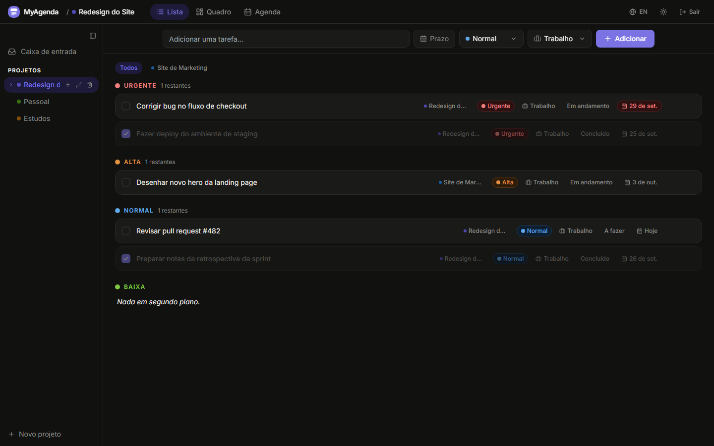<br /><sub>Visualização em lista, agrupada por prioridade</sub></td>
    <td align="center">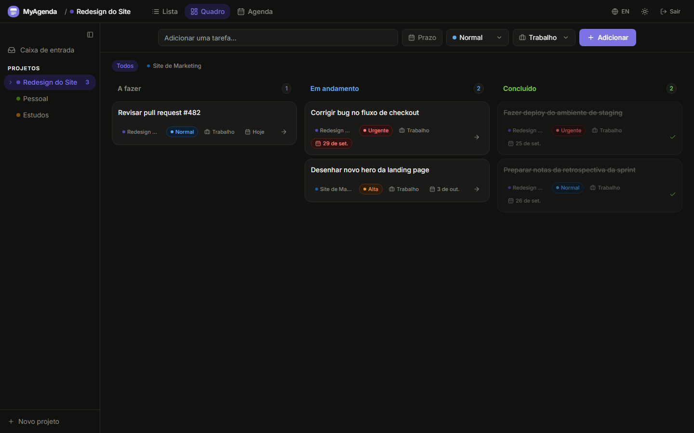<br /><sub>Visualização em quadro, Kanban com arrastar e soltar</sub></td>
  </tr>
  <tr>
    <td align="center">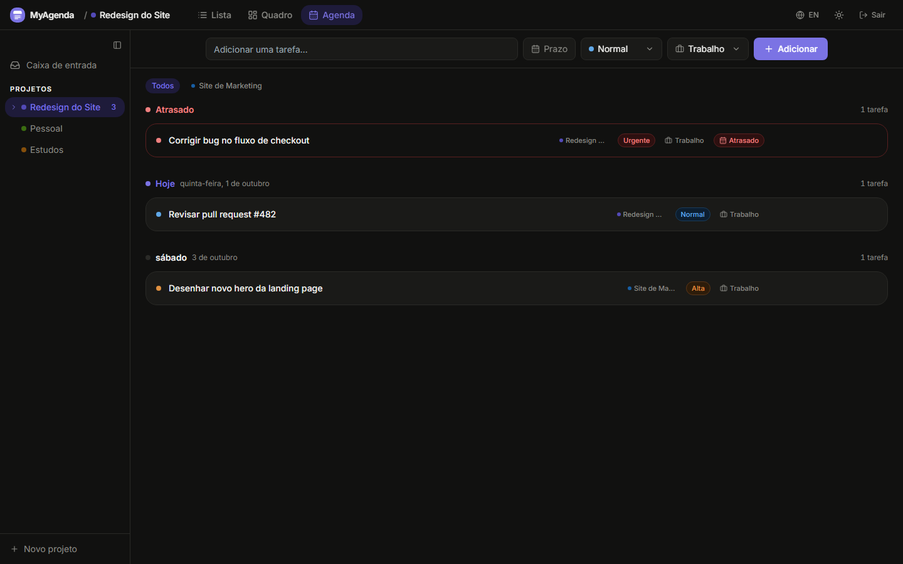<br /><sub>Visualização em agenda, agrupada por prazo</sub></td>
    <td align="center">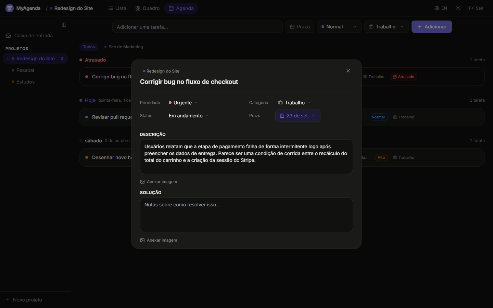<br /><sub>Detalhes da tarefa, salvamento automático, notas e imagens</sub></td>
  </tr>
  <tr>
    <td align="center">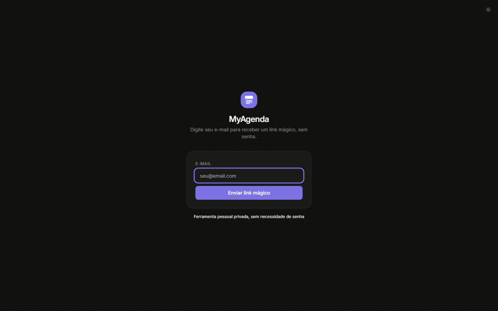<br /><sub>Login por magic link</sub></td>
    <td align="center">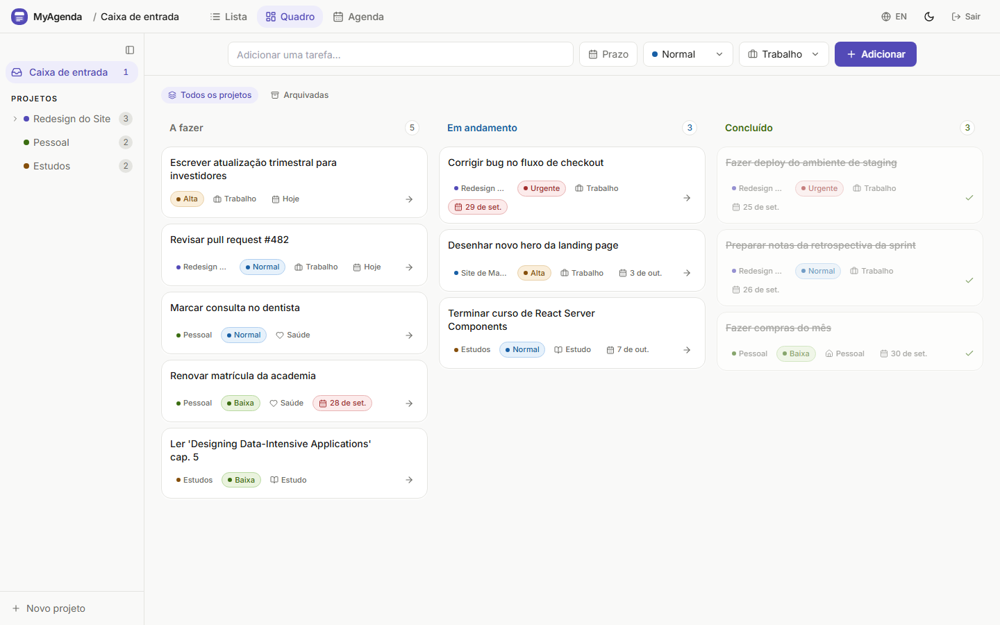<br /><sub>Tema claro (o escuro é o padrão acima)</sub></td>
  </tr>
</table>

### Funcionalidades

- **Login por Magic Link**, autenticação sem senha via e-mail
- **Projetos e subprojetos**, um nível de aninhamento; projetos pai agregam tarefas de todos os filhos
- **Três visualizações**, Lista (agrupada por prioridade), Quadro (Kanban), Agenda (agrupada por prazo)
- **Modal de detalhes da tarefa**, salva automaticamente enquanto você digita; edite título, descrição, notas de solução, prioridade, categoria, status e prazo
- **Anexos de imagem**, adicione imagens à descrição e ao campo de solução, armazenadas de forma privada no Supabase Storage
- **Arrastar e soltar**, reorganize tarefas entre colunas do Kanban
- **Tema escuro / claro**
- **Interface em Inglês / Português**, trocável em tempo real

### Stack técnica

| Camada | Tecnologia |
|---|---|
| Framework | React 19, TypeScript |
| Build | Vite |
| Estilização | Tailwind CSS, primitivos Radix UI, `class-variance-authority` |
| Drag-and-drop | `@dnd-kit` |
| Backend | Supabase (Postgres, Auth, Storage) |
| Deploy | Vercel |

### Destaques de engenharia

Alguns pontos que vale a pena olhar mais de perto no código:

- **Segurança no nível do banco de dados**, todas as tabelas e políticas de storage restringem as linhas via `auth.uid()` usando Row Level Security do Postgres ([`supabase-setup.sql`](supabase-setup.sql)), garantindo controle de acesso mesmo que o cliente fosse comprometido.
- **Armazenamento de arquivos privado e isolado por usuário**, as imagens das tarefas ficam em um bucket não-público do Supabase Storage; as políticas usam a convenção de caminho `user_id/task_id/arquivo.jpg`, de forma que só o dono consegue ler, escrever ou apagar seus próprios arquivos.
- **Modelo de domínio tipado**, `Task`, `Project` e seus enums (`Priority`, `Category`, `Status`) são definidos uma única vez em [`src/types.ts`](src/types.ts) e compartilhados entre hooks, views e o modal.
- **Modal de tarefa com salvamento automático**, as edições são persistidas enquanto você digita, sem ação explícita de salvar, com atualização otimista de estado via hooks dedicados `useTasks` / `useProjects`.
- **Internacionalização tipada**, um sistema de chaves de tradução ([`src/lib/i18n.ts`](src/lib/i18n.ts)) apoiado em um `LanguageContext`, em vez de strings soltas pelo código.

### Estrutura do projeto

```
src/
├── components/     # Componentes de visualização (Lista, Kanban, Agenda), modal de tarefa, sidebar, primitivos de UI
│   └── ui/         # Componentes primitivos baseados em Radix
├── contexts/        # Providers de idioma e toast
├── hooks/           # useAuth, useTasks, useProjects, useTheme
├── lib/             # Cliente Supabase, i18n, helpers de data, utils
├── types.ts          # Tipos de domínio compartilhados
├── App.tsx
└── main.tsx
```

---

### Como rodar o projeto

**Pré-requisitos**

- [Node.js](https://nodejs.org/) 18+
- Uma conta no [Supabase](https://supabase.com) (o plano gratuito funciona)
- Uma conta no [Vercel](https://vercel.com) (opcional, para deploy)

**1. Clone o repositório**

```bash
git clone https://github.com/italoglhrm/myagenda-app.git
cd myagenda-app
```

**2. Configure o Supabase**

<details>
<summary><strong>Configuração completa do Supabase (banco, storage, auth), clique para expandir</strong></summary>

#### 2.1 Crie um projeto
1. Acesse [supabase.com](https://supabase.com) e crie um novo projeto
2. Aguarde o banco de dados terminar de ser provisionado

#### 2.2 Execute o schema do banco de dados
1. No painel do Supabase, vá em **SQL Editor**
2. Abra o arquivo `supabase-setup.sql` deste repositório
3. Cole o conteúdo e clique em **Run**

Isso cria as tabelas `tasks` e `projects` com Row Level Security ativado.

#### 2.3 Crie o bucket de armazenamento para imagens
1. Vá em **Storage → New bucket**
2. Nomeie como `task-images`
3. Deixe o **Public bucket desativado** (as imagens são privadas, só o dono autenticado pode acessá-las)
4. Clique em **Save**

#### 2.4 Adicione as políticas de armazenamento
As imagens são protegidas por Row Level Security. Você precisa adicionar três políticas para que os usuários possam fazer upload, visualizar e deletar apenas as próprias imagens.

Vá em **Storage → Policies → New policy** no bucket `task-images`. Em cada política, clique em **"For full customization"** e preencha os campos abaixo.

**Política 1, Upload (INSERT)**
- Policy name: `owner can upload`
- Allowed operation: `INSERT`
- WITH CHECK expression:
```sql
bucket_id = 'task-images' AND auth.uid()::text = (storage.foldername(name))[1]
```

**Política 2, Visualizar (SELECT)**
- Policy name: `owner can view`
- Allowed operation: `SELECT`
- USING expression:
```sql
bucket_id = 'task-images' AND auth.uid()::text = (storage.foldername(name))[1]
```

**Política 3, Deletar (DELETE)**
- Policy name: `owner can delete`
- Allowed operation: `DELETE`
- USING expression:
```sql
bucket_id = 'task-images' AND auth.uid()::text = (storage.foldername(name))[1]
```

> As três políticas usam a mesma lógica: o primeiro segmento do caminho do arquivo (`user_id/task_id/arquivo.jpg`) precisa bater com o `uid` do usuário logado. Ninguém além de você acessa suas imagens.

#### 2.5 Ative o login por Magic Link
1. Vá em **Authentication → Providers**
2. Certifique-se de que **Email** está habilitado
3. Vá em **Authentication → URL Configuration**
4. Adicione sua URL local em **Redirect URLs**: `http://localhost:5173`
   - Em produção, adicione também a URL do Vercel: `https://seu-app.vercel.app`

#### 2.6 Obtenha as chaves de API
1. Vá em **Project Settings → API**
2. Copie a **Project URL** e a chave **anon / public**

</details>

**3. Configure as variáveis de ambiente**

Crie um arquivo `.env` na raiz do projeto:

```env
VITE_SUPABASE_URL=https://seu-project-id.supabase.co
VITE_SUPABASE_ANON_KEY=sua-chave-anonima
```

> O arquivo `.env` está no `.gitignore` e nunca será enviado ao repositório.

**4. Instale as dependências e rode localmente**

```bash
npm install
npm run dev
```

O app estará disponível em `http://localhost:5173`.

**5. Deploy no Vercel**

1. Suba seu código para o GitHub
2. Acesse [vercel.com](https://vercel.com) → **Add New → Project**
3. Importe o repositório do GitHub
4. Em **Environment Variables**, adicione `VITE_SUPABASE_URL` e `VITE_SUPABASE_ANON_KEY`
5. Clique em **Deploy**

Após o deploy, volte ao Supabase → **Authentication → URL Configuration** e adicione a URL do Vercel em **Redirect URLs**. A cada `git push` para a branch `main`, o Vercel fará o redeploy automaticamente.

---

<div align="center">

Built by [@italoglhrm](https://github.com/italoglhrm)

</div>
